# AEOS Phase 9 DRP — Sequence Diagrams

**Document:** `018-SEQUENCE_DIAGRAMS.md`  
**Suite:** Architecture Verification Suite (AVS)  
**Status:** Approved  
**Date:** 2026-07-06

All diagrams are in PlantUML notation for rendering in documentation tools and IDEs.

---

## Diagram Index

| ID | Title |
|----|-------|
| [SEQ-001](#seq-001) | Happy Path Task Execution |
| [SEQ-002](#seq-002) | Distributed Fan-Out / Fan-In Execution |
| [SEQ-003](#seq-003) | Raft Leader Election |
| [SEQ-004](#seq-004) | Worker Crash and Recovery |
| [SEQ-005](#seq-005) | Checkpoint Recovery (Orphan Scan) |
| [SEQ-006](#seq-006) | Cluster Join |
| [SEQ-007](#seq-007) | Rolling Deployment (Drain Protocol) |
| [SEQ-008](#seq-008) | KEDA Autoscaling |
| [SEQ-009](#seq-009) | Governance Token Approval and Execution |
| [SEQ-010](#seq-010) | Governance Token Revocation |
| [SEQ-011](#seq-011) | mTLS Certificate Rotation |
| [SEQ-012](#seq-012) | Split-Brain Prevention via Execution Lease |

---

## SEQ-001

### Happy Path Task Execution

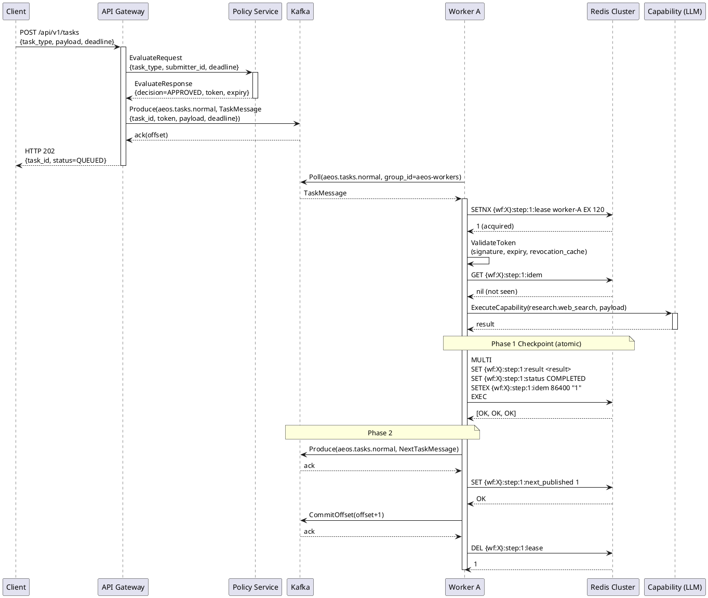

---

## SEQ-002

### Distributed Fan-Out / Fan-In Execution

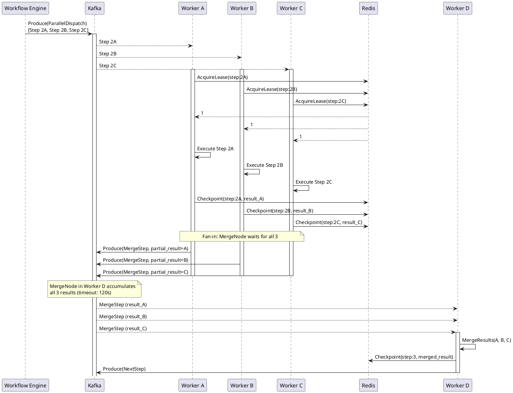

---

## SEQ-003

### Raft Leader Election

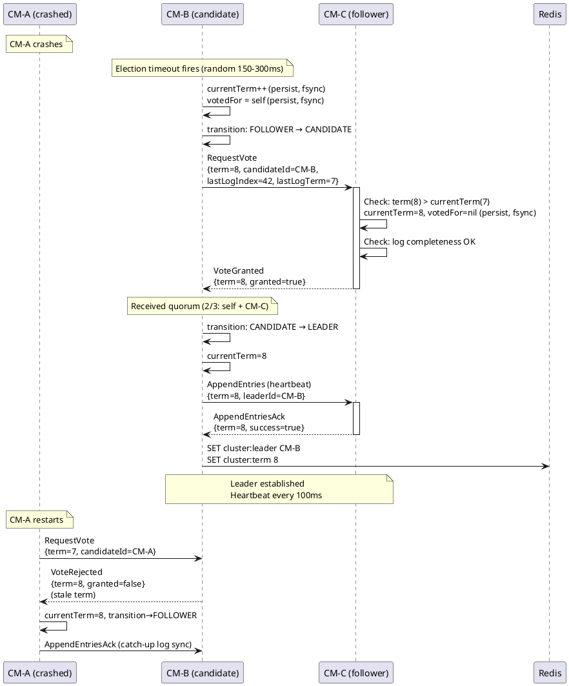

---

## SEQ-004

### Worker Crash and Recovery

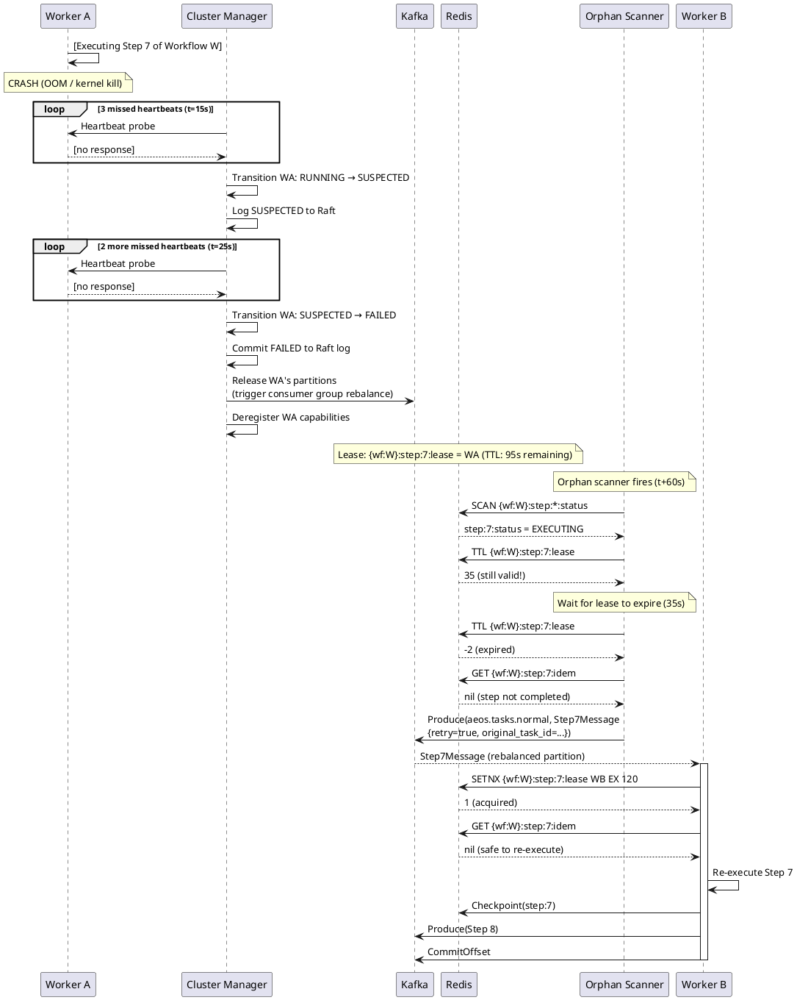

---

## SEQ-005

### Checkpoint Recovery (Orphan Scan — Phase 2 Incomplete)

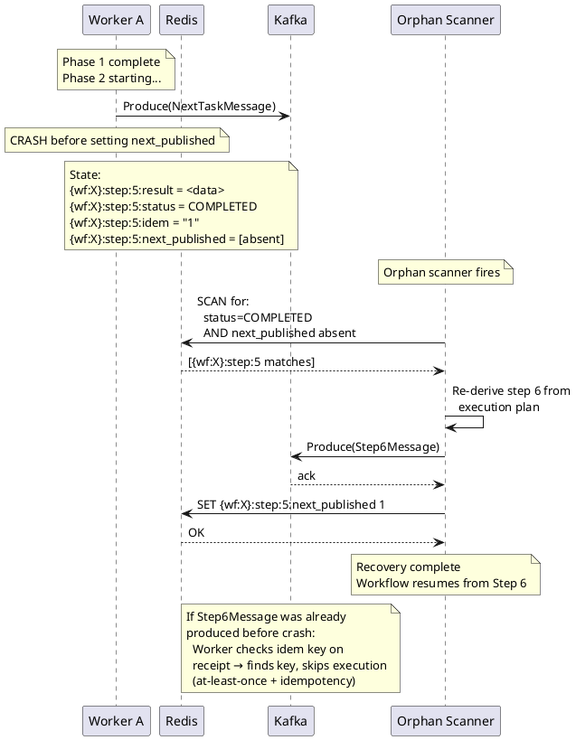

---

## SEQ-006

### Cluster Join

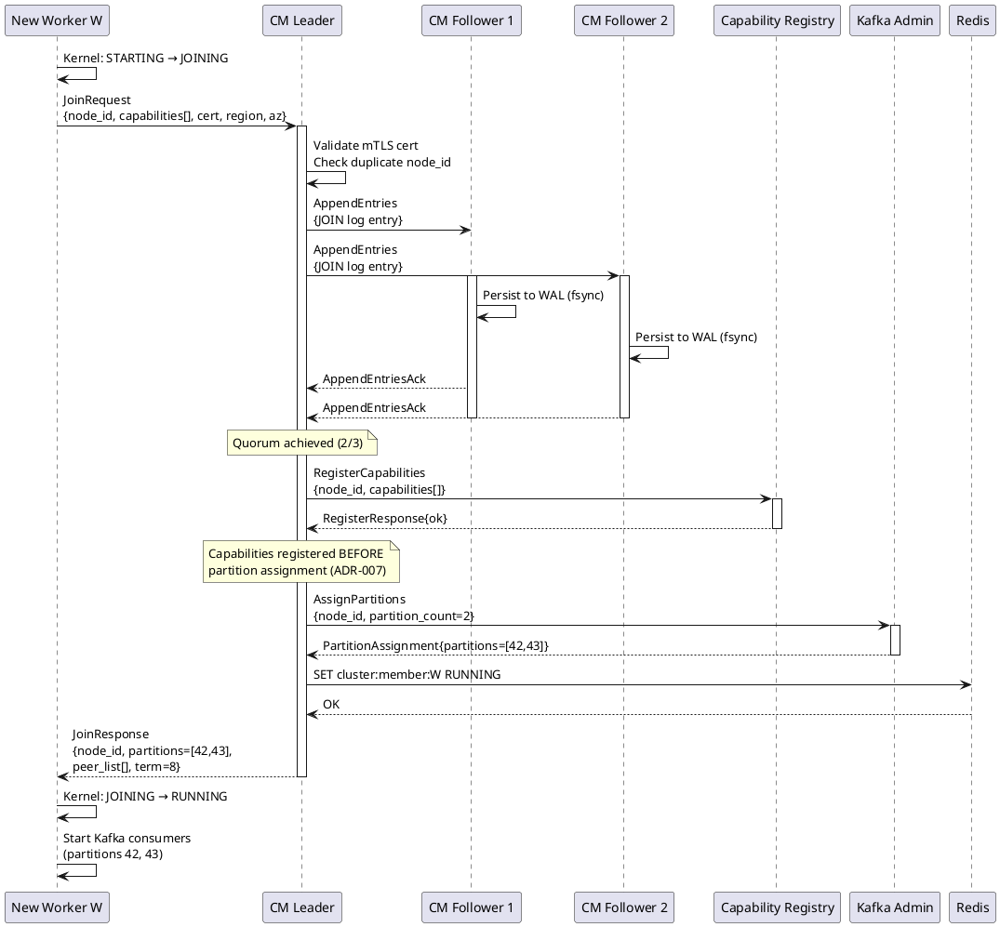

---

## SEQ-007

### Rolling Deployment (Drain Protocol)

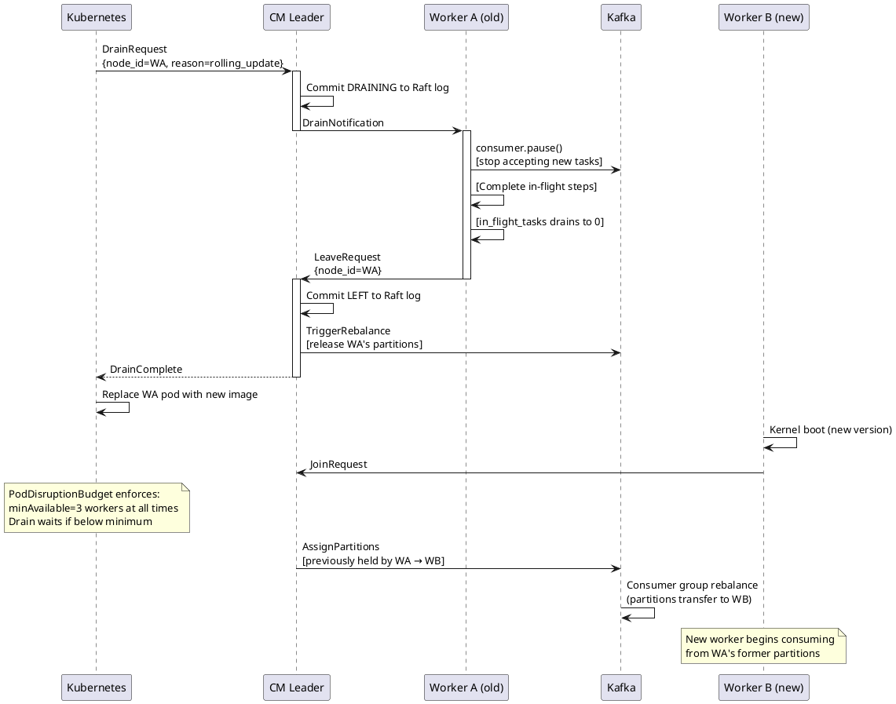

---

## SEQ-008

### KEDA Autoscaling

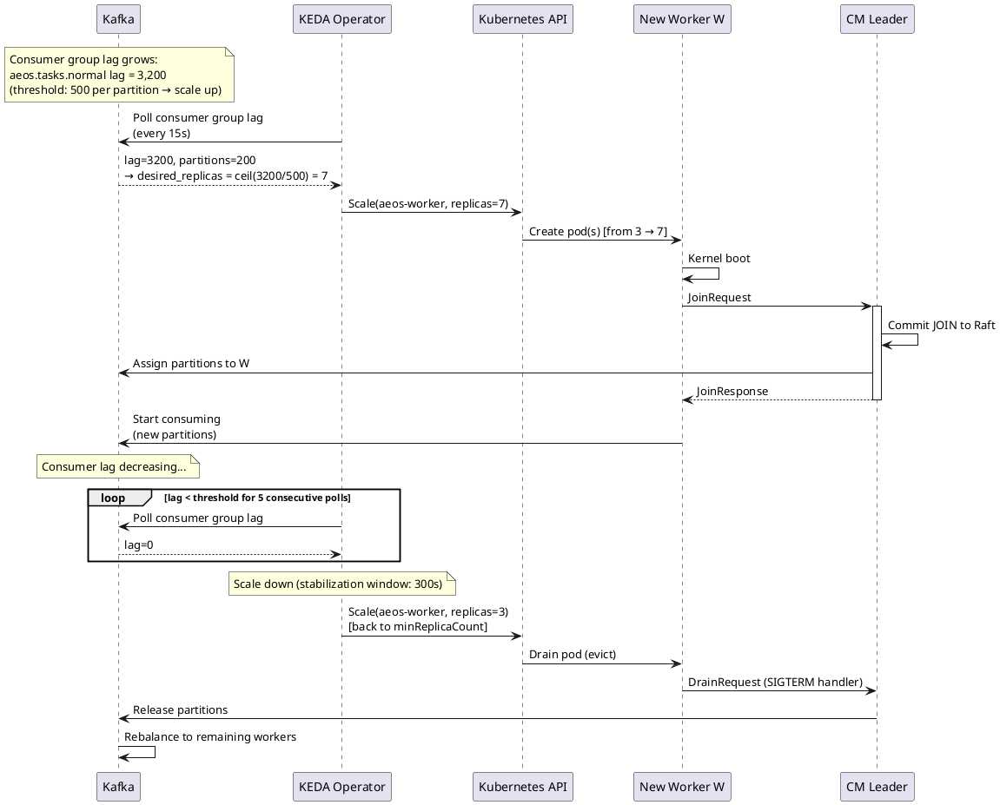

---

## SEQ-009

### Governance Token Approval and Execution

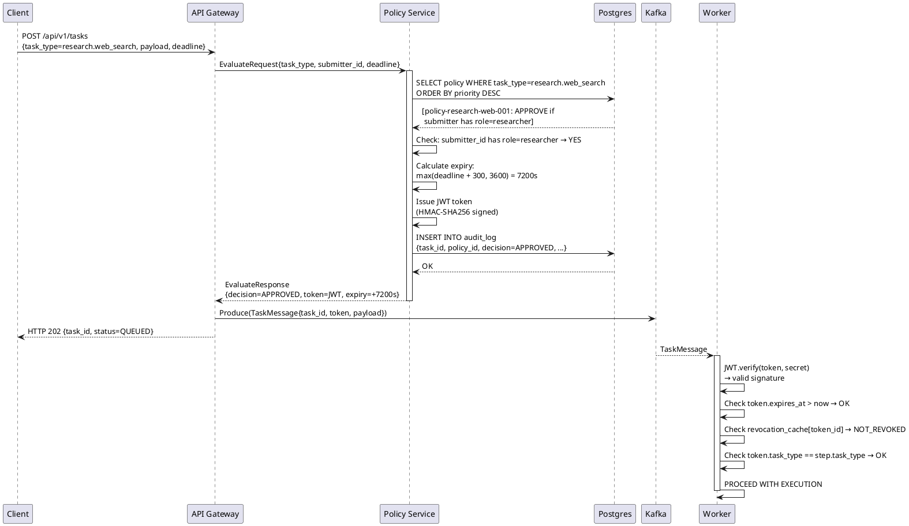

---

## SEQ-010

### Governance Token Revocation

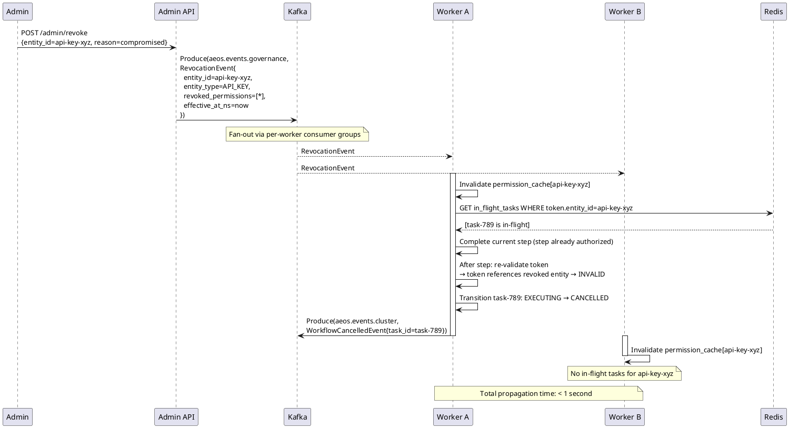

---

## SEQ-011

### mTLS Certificate Rotation

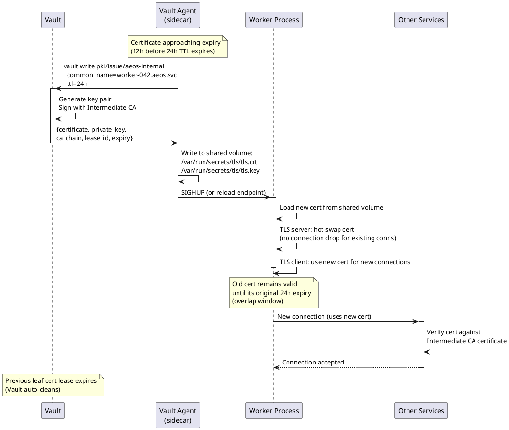

---

## SEQ-012

### Split-Brain Prevention via Execution Lease

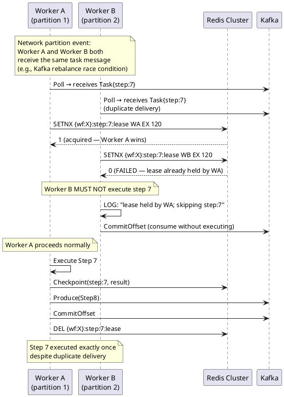

---

*End of Sequence Diagrams — `018-SEQUENCE_DIAGRAMS.md`*
